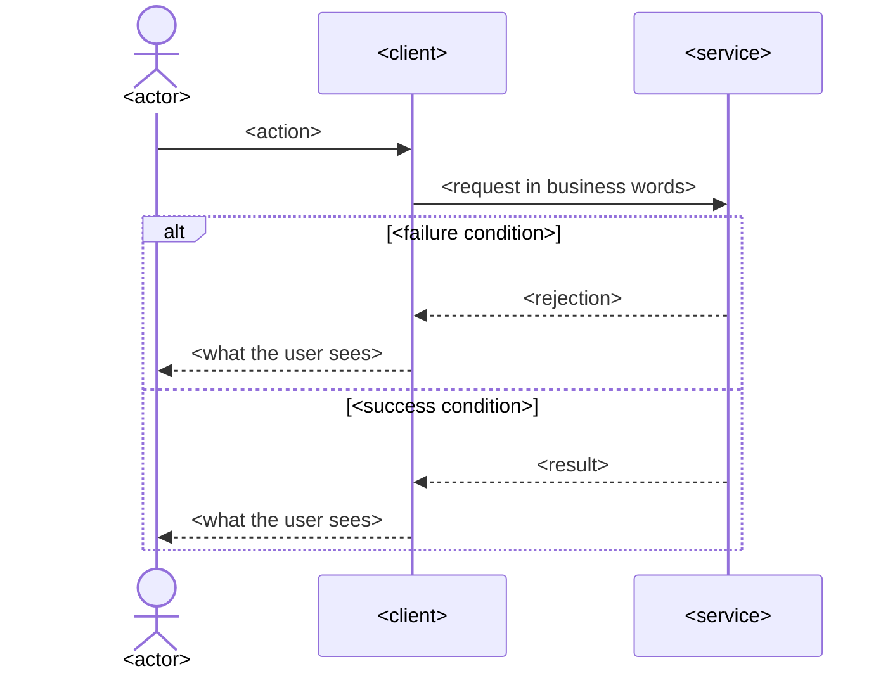
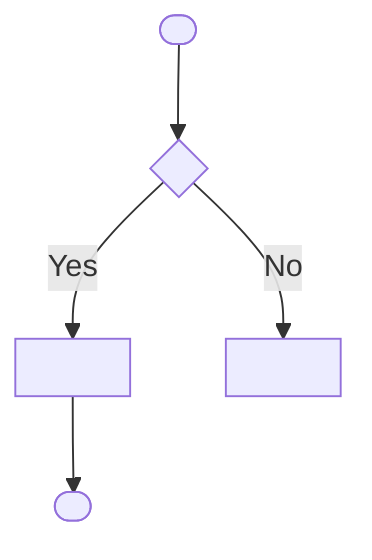

# <Feature title> - flows

## Flow: <flow-slug>

<One sentence: who does what, and the outcome.>

### Sequence

```mermaid
sequenceDiagram
    actor User as <actor>
    participant App as <client>
    participant Service as <service>
    User->>App: <action>
    App->>Service: <request in business words>
    alt <failure condition>
        Service-->>App: <rejection>
        App-->>User: <what the user sees>
    else <success condition>
        Service-->>App: <result>
        App-->>User: <what the user sees>
    end
```

### Activity

```mermaid
flowchart TD
    A(["<start>"]) --> B{"<decision?>"}
    B -->|"Yes"| C["<step>"]
    B -->|"No"| E["<error shown>"]
    C --> D(["<end>"])
```
