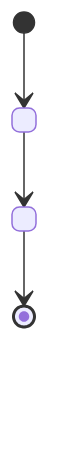

# <Feature title> - states

## State: <Entity>

```mermaid
stateDiagram-v2
    [*] --> <First> : <trigger>
    <First> --> <Second> : <trigger>
    <Second> --> [*]
```

| From | To | Label | Source |
|---|---|---|---|
| <state> | <state> | ✅ | `<submodule_root>/<repo>/<path>:<line>` |
